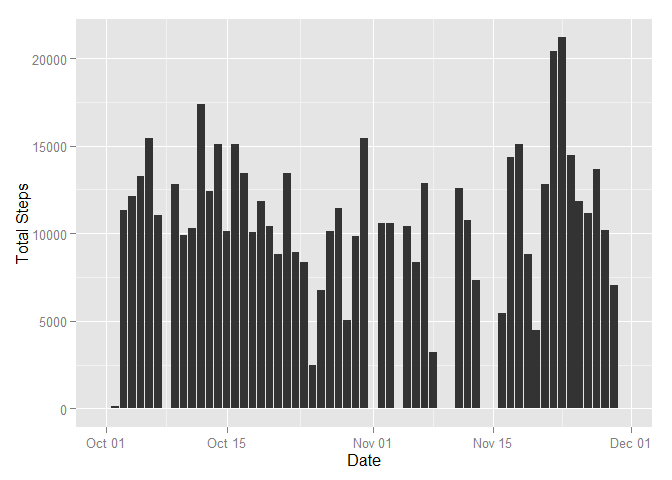
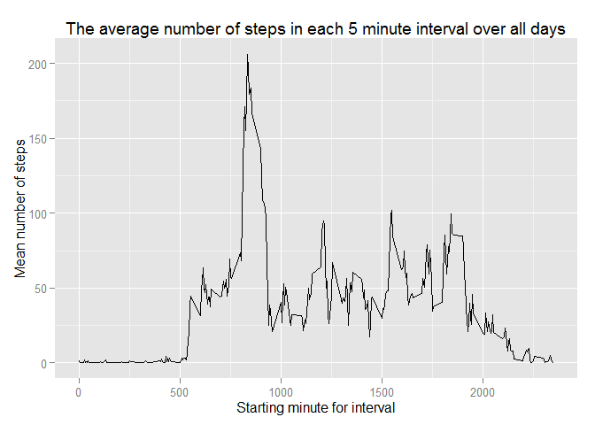
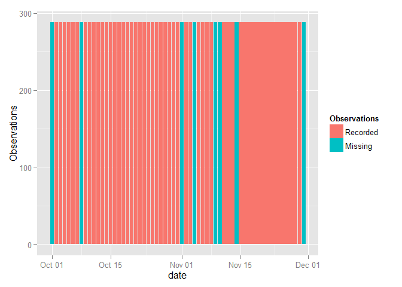
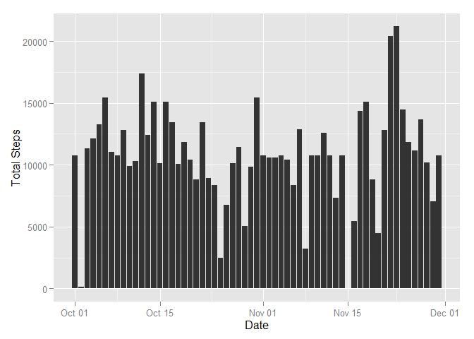
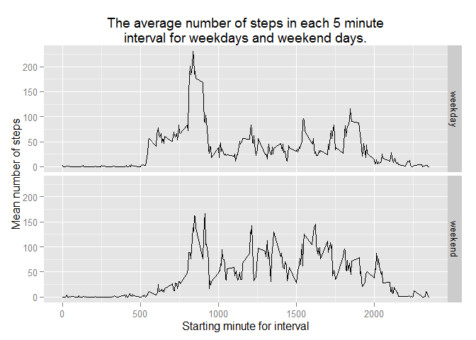

# Reproducible Research: Peer Assessment 1
Yilmaz Rona  
October 16, 2015  


## Loading and preprocessing the data


[The original dataset is published on the Internet[52.3 Kb].](https://d396qusza40orc.cloudfront.net/repdata%2Fdata%2Factivity.zip)


```r
str(activity_data)
```

```
## 'data.frame':	17568 obs. of  3 variables:
##  $ steps   : int  NA NA NA NA NA NA NA NA NA NA ...
##  $ date    : POSIXlt, format: "2012-10-01" "2012-10-01" ...
##  $ interval: int  0 5 10 15 20 25 30 35 40 45 ...
```

```r
summary(activity_data)
```

```
##      steps             date                        interval     
##  Min.   :  0.00   Min.   :2012-10-01 00:00:00   Min.   :   0.0  
##  1st Qu.:  0.00   1st Qu.:2012-10-16 00:00:00   1st Qu.: 588.8  
##  Median :  0.00   Median :2012-10-31 00:00:00   Median :1177.5  
##  Mean   : 37.38   Mean   :2012-10-31 00:25:34   Mean   :1177.5  
##  3rd Qu.: 12.00   3rd Qu.:2012-11-15 00:00:00   3rd Qu.:1766.2  
##  Max.   :806.00   Max.   :2012-11-30 00:00:00   Max.   :2355.0  
##  NA's   :2304
```


## What is mean total number of steps taken per day?


 

The mean number of steps per day is 9,354.23.  The median number of steps per day is 10,395.


## What is the average daily activity pattern?
 


On average, the highest activity is in the 5 minute interval starting at minute 835 where the mean number of steps is 206.1698.

## Imputing missing values

A quick note;  what we are being asked to do here is ethically and scientifically suspect. When one infills missing data, one is manufacturing data.  There is no difference between making up observations to overwrite missing values and replacing valid observations with made up data.  Since this assignment will not be used for any decision whatsoever, let alone decisions affecting lives or people's health, I will do what's asked. However, if I were asked to do something like this professionally, I would refuse.  

In order to make up values to 'replace' missing values, we should first know what physically caused the detector to fail to make an observation. We have no information that allows us to know this.  So I will presume that the missing values occur when the detector is turned off.    


There are 2,304 observations that are missing from the original data set.

We plot the number of recorded observations and the number of missing observations for each date of the study:

 

It is apparent that when data is missing, the entire day is affected; either 288 observations are recorded, or no observations are recorded whatsoever.

So, the data we make up will be somewhat less damaging to the accuracy of our dataset if we crudely insert the mean values observed for each interval over the entire two months in place of the missing data. 


 

The mean number of steps per day is 10,766.19.  The median number of steps per day is 10,766.19.  These values differ from the averages calculated purely from observations. I am not certain if the fact that the median and the mean are identical is a coincidence of an artifact of the infilling operation.

## Are there differences in activity patterns between weekdays and weekends?


Below we can see the differences in the mean activity levels over all 5 minute intervals on weekdays and on weekends.  One can see that on weekends, the wearer was far more likely to engage in significant walking activity throughout the day, whereas except during the morning, on weekdays the wearer was more sedentary. 

 

